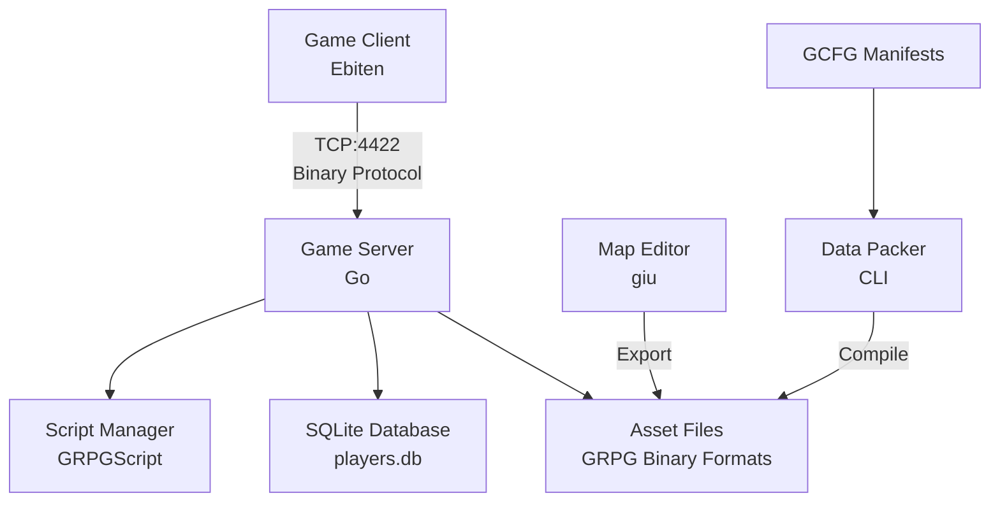

# GRPG Architecture

GRPG is built around a traditional MMO client-server architecture with custom networking, binary serialization, and a tick-based game loop. This guide explores the core architectural decisions and how they work together.

## System Overview



## Client-Server Architecture

### Server (server-go/)

The server is the authoritative source of truth for all game state. It handles:

- **Player authentication** and session management
- **Game loop** running at 60ms tick intervals
- **World state** including chunk loading, object states, and NPC positions
- **Packet processing** from connected clients
- **Database persistence** for player data, inventories, and skills
- **Content scripting** via the ScriptManager

#### Game State Structure

```go server-go/main.go
var g = &shared.Game{
    Players:      map[*shared.Player]struct{}{},       // All connected players
    Connections:  make(map[net.Conn]*shared.Player),   // Conn → Player mapping
    TrackedObjs:  make(map[util.Vector2I]*shared.GameObj), // Position → Object
    Objs:         make(map[util.Vector2I]struct{}),    // Object positions
    TrackedNpcs:  make(map[util.Vector2I]*shared.GameNpc), // Position → NPC
    TimedScripts: make(map[uint32][]func()),           // Tick → Callbacks
    Mu:           sync.RWMutex{},                      // Concurrency control
    NpcMoves:     map[util.Vector2I][][]shared.NpcMove{}, // Pending movements
    MaxX:         0,
    MaxY:         0,
    CurrentTick:  0,
}
```

All game state is protected by a `RWMutex` to safely handle concurrent access from multiple goroutines (connection handlers, game loop, etc.).

### Client (client-go/)

The client is a thin rendering layer that:

- Connects to the server via TCP
- Sends player input (movement, interactions)
- Receives world updates and renders them
- Manages local UI state (inventory screen, dialogue boxes)
- Uses **Ebiten v2** for cross-platform rendering

#### Client State Structure

```go client-go/main.go
var g = &shared.Game{
    ScreenWidth:  1152,
    ScreenHeight: 960,
    ScreenRatio:  1152.0/960.0,
    TileSize:     64,
    CollisionMap: make(map[util.Vector2I]struct{}),
    ObjIdByLoc:   make(map[util.Vector2I]uint16),
    TrackedObjs:  make(map[util.Vector2I]*shared.GameObj),
    TrackedNpcs:  make(map[util.Vector2I]*shared.GameNpc),
    Skills:       make(map[shared.Skill]*shared.SkillInfo),
    Player: &shared.LocalPlayer{
        X:         0,
        Y:         0,
        RealX:     0,  // Interpolated position for smooth movement
        RealY:     0,
        Facing:    shared.UP,
        Inventory: [24]shared.InventoryItem{},
        Name:      "",
    },
    OtherPlayers: map[string]*shared.RemotePlayer{},
    Conn:         network.StartConn(),
}
```

The client maintains a **local projection** of the game state received from the server.

## Networking Protocol

### Custom Binary Protocol

GRPG uses a custom binary protocol built on TCP for reliable, ordered delivery. The protocol is defined using the **GBuf** library for efficient serialization.

#### Packet Structure

Every packet follows this structure:

```text
┌────────────┬────────────┬─────────────────┐
│  Opcode    │  Length    │     Payload     │
│  (1 byte)  │ (variable) │   (variable)    │
└────────────┴────────────┴─────────────────┘
```

- **Opcode**: Identifies the packet type (login, movement, object interaction, etc.)
- **Length**: Defined per-packet type in the protocol definition
- **Payload**: Binary-encoded data using GBuf

#### GBuf Serialization

GBuf provides convenience methods for reading/writing binary data in **big-endian** format:

```go data-go/gbuf/gbuf.go
// Writing
buf := gbuf.NewEmptyGBuf()
buf.WriteUint16(1234)        // 2 bytes
buf.WriteUint32(5678)        // 4 bytes
buf.WriteString("Hello")     // 4 bytes (length) + N bytes (string)
buf.WriteBool(true)          // 1 byte (0x01 or 0x00)
bytes := buf.Bytes()         // Get serialized data

// Reading
buf := gbuf.NewGBuf(bytes)
val1, _ := buf.ReadUint16()  // 1234
val2, _ := buf.ReadUint32()  // 5678
str, _ := buf.ReadString()   // "Hello"
flag, _ := buf.ReadBool()    // true
```

**Key features:**
- Big-endian encoding for network byte order
- Length-prefixed strings (uint32 length + UTF-8 bytes)
- Error handling for buffer overruns
- Zero-copy reading (slices into backing array)

### Connection Handling

The server accepts connections and spawns a goroutine per client:

```go server-go/main.go
func handleClient(conn net.Conn, game *shared.Game, packets chan ChanPacket) {
    defer conn.Close()
    reader := bufio.NewReader(conn)

    for {
        // Read opcode
        opcode, err := reader.ReadByte()
        if err != nil {
            // Connection lost - save player and cleanup
            game.Mu.RLock()
            player, exists := game.Connections[conn]
            game.Mu.RUnlock()

            if exists {
                player.SaveToDB(game.Database)
                game.Mu.Lock()
                delete(game.Players, player)
                game.Mu.Unlock()
            }
            return
        }

        // Handle login separately (variable length)
        if opcode == 0x01 {
            handleLogin(reader, conn, game)
            continue
        }

        // Read fixed-length packet
        packetData := c2s.Packets[opcode]
        bytes := make([]byte, packetData.Length)
        _, err = io.ReadFull(reader, bytes)
        if err != nil {
            return
        }

        // Queue packet for processing in game loop
        game.Mu.RLock()
        player := game.Connections[conn]
        game.Mu.RUnlock()

        packets <- ChanPacket{
            Bytes:      bytes,
            Player:     player,
            PacketData: packetData,
        }
    }
}
```

**Important design decisions:**

1. **Buffered reading**: Uses `bufio.Reader` to reduce syscalls
2. **Graceful disconnect**: Saves player data on connection loss
3. **Lock minimization**: Only holds locks during map access, not I/O
4. **Packet queuing**: Sends packets to game loop channel for deterministic processing

### Login Flow

```go server-go/main.go
func handleLogin(reader *bufio.Reader, conn net.Conn, game *shared.Game) {
    // Read length-prefixed username
    nameLenBytes := make([]byte, 4)
    io.ReadFull(reader, nameLenBytes)
    nameLen := binary.BigEndian.Uint32(nameLenBytes)
    
    name := make([]byte, nameLen)
    io.ReadFull(reader, name)

    // Check for duplicate names
    for player, _ := range game.Players {
        if player.Name == string(name) {
            network.SendPacket(conn, &s2c.LoginRejected{}, game)
            return
        }
    }

    // Create or load player
    player := &shared.Player{
        Pos:       util.Vector2I{X: 0, Y: 0},
        ChunkPos:  util.Vector2I{X: 0, Y: 0},
        Facing:    shared.UP,
        Name:      string(name),
        Inventory: shared.Inventory{Items: [24]shared.InventoryItem{}},
        Conn:      conn,
    }

    // Attempt to load existing player from database
    err := player.LoadFromDB(game.Database)
    if err != nil {
        network.SendPacket(conn, &s2c.LoginRejected{}, game)
        return
    }

    // Add player to game state
    game.Mu.Lock()
    game.Players[player] = struct{}{}
    game.Connections[conn] = player
    game.Mu.Unlock()

    // Send initial game state
    network.SendPacket(conn, &s2c.LoginAccepted{}, game)
    network.SendPacket(player.Conn, &s2c.ObjUpdate{ChunkPos: player.ChunkPos, Rebuild: true}, game)
    network.SendPacket(player.Conn, &s2c.NpcUpdate{ChunkPos: player.ChunkPos}, game)
    network.SendPacket(player.Conn, &s2c.InventoryUpdate{Player: player}, game)
    network.SendPacket(player.Conn, &s2c.SkillUpdate{Player: player, SkillIds: shared.ALL_SKILLS}, game)
}
```

The login process:
1. Reads username from client
2. Checks for duplicate usernames
3. Loads player from database (or creates new)
4. Adds player to game state
5. Sends initial world state to client

## Game Loop (Tick System)

The server runs a deterministic tick-based game loop at **60ms intervals** (~16.67 ticks/second):

```go server-go/main.go
func cycle(packets chan ChanPacket) {
    for {
        expectedTime := time.Now().Add(60 * time.Millisecond)

        // Process all queued packets
    processPackets:
        for {
            select {
            case packet := <-packets:
                buf := gbuf.NewGBuf(packet.Bytes)
                packet.PacketData.Handler.Handle(buf, g, packet.Player, scriptManager)
            default:
                break processPackets
            }
        }

        // Execute timed scripts (e.g., berry bush respawn)
        timed, ok := g.TimedScripts[g.CurrentTick]
        if ok {
            for _, script := range timed {
                script()
            }
        }

        // Process NPC movements every 300 ticks (~18 seconds)
        if g.CurrentTick >= 300 {
            for chunk, moves := range g.NpcMoves {
                // Process one step of each NPC's path
                // Update player clients with NpcMoves packet
                // ...
            }
        }

        g.CurrentTick++
        
        // Sleep for remaining time to maintain 60ms tick rate
        diff := time.Until(expectedTime)
        if diff > 0 {
            time.Sleep(diff)
        }
    }
}
```

**Why tick-based?**

- **Determinism**: All game logic executes in a single thread, eliminating race conditions
- **Replay capability**: Can record and replay ticks for debugging
- **Predictable timing**: Timed events (respawns, cooldowns) are tick-based, not wall-clock
- **Synchronization**: All clients advance at the same logical time

## Data Formats

GRPG uses custom binary formats for game assets, optimized for fast loading and minimal disk space.

### GRPGTEX (Textures)

Stores textures with JPEG XL compression and metadata:

- **String ID**: Human-readable identifier (e.g., "grass_tile")
- **Numeric ID**: uint16 for fast lookups in other formats
- **Image Data**: JPEG XL compressed PNG (significantly smaller than PNG)
- **Type Info**: Additional metadata (tile type, collision, etc.)

```go data-go/grpgtex/
// Example texture entry
Texture {
    StringID: "berry_bush"
    NumericID: 42
    ImageData: []byte{...}  // JPEG XL encoded
    TileType: INTERACTABLE
}
```

### GRPGMAP (Maps)

Chunk-based map format:

- **Chunk Size**: 16x16 tiles
- **Tile Data**: uint16 array referencing texture IDs
- **Collision Map**: Bitfield for walkable tiles
- **Object Positions**: Sparse array of object placements

### GRPGNPC (NPCs)

NPC definitions:

- **Numeric ID**: uint16 identifier
- **Texture Reference**: ID from GRPGTEX
- **Base Stats**: Health, movement speed, etc.
- **Script Reference**: Links to GRPGScript behaviors

### GRPGOBJ (Objects)

Interactive objects (doors, chests, bushes):

- **Numeric ID**: uint16 identifier
- **Texture Reference**: ID from GRPGTEX
- **State Count**: Number of visual states (e.g., 2 for depleted/full berry bush)
- **Collision**: Whether the object blocks movement
- **Script Reference**: Links to interaction scripts

### GRPGITEM (Items)

Inventory items:

- **Numeric ID**: uint16 identifier
- **Texture Reference**: Icon from GRPGTEX
- **Stackable**: Boolean
- **Max Stack**: uint16

## Data Packer Pipeline

The data-packer CLI converts human-readable manifests (GCFG format) into optimized binary formats:

```bash
# Convert PNG textures to GRPGTEX (with JPEG XL compression)
grpgpack tex -m textures.gcfg -o textures.grpgtex

# Compile tiles referencing textures
grpgpack tile -m tiles.gcfg -o tiles.grpgtile -t textures.grpgtex

# Compile objects
grpgpack obj -m objs.gcfg -o objs.grpgobj -t textures.grpgtex
```

**Pipeline:**

```
GCFG Manifest → Data Packer → Binary Format → Server/Client
```

The only transformation is **PNG → JPEG XL** for textures. Everything else is a 1:1 mapping from manifest to binary.

## Content Scripting System

GRPG uses a **Go-based content scripting** system (not to be confused with GRPGScript, the standalone scripting language).

### Object Interactions

Example from `server-go/content/berry_bush.go`:

```go
func init() {
    scripts.OnObjInteract(scripts.BERRY_BUSH, func(ctx *scripts.ObjInteractCtx) {
        if ctx.GetObjState() == 0 {  // Bush has berries
            ctx.SetObjState(1)         // Deplete bush
            ctx.PlayerInvAdd(scripts.BERRIES)  // Give item
            ctx.PlayerAddXp(shared.Foraging, 100)  // Award XP

            ctx.AddTimer(100, func() { // Respawn after 100 ticks
                ctx.SetObjState(0)
            })
        }
    })
}
```

**Context API:**
- `GetObjState()` / `SetObjState()`: Object state management
- `PlayerInvAdd(itemID)`: Add item to player inventory
- `PlayerAddXp(skill, amount)`: Award skill XP
- `AddTimer(ticks, callback)`: Schedule future execution

### NPC Dialogues

Example from `server-go/content/test_npc.go`:

```go
func init() {
    // Spawn NPC at (3, 3) with wander range 2
    scripts.SpawnNpc(scripts.TEST, 3, 3, 2)

    scripts.OnTalkNpc(scripts.TEST, func(ctx *scripts.NpcTalkCtx) {
        ctx.ClearDialogueQueue()
        ctx.TalkPlayer("Hello, test")
        ctx.TalkNpc("...")
        ctx.TalkPlayer("See you!")
        ctx.StartDialogue()
    })
}
```

**NPC Spawning:**
```go
scripts.SpawnNpc(npcID, x, y, wanderRange)
```

NPCs wander within their range and return to spawn points.

## Database Schema & Persistence

GRPG uses **SQLite** with **golang-migrate** for versioned schema management.

### Initial Schema

```sql db/migrations/000001_initial.up.sql
CREATE TABLE players (
    player_id INTEGER PRIMARY KEY,
    name TEXT NOT NULL,
    x INTEGER NOT NULL,
    y INTEGER NOT NULL
);
```

### Auto-Save on Disconnect

When a player disconnects, their state is automatically saved:

```go
player.SaveToDB(game.Database)
```

On login, the server attempts to load existing data:

```go
err := player.LoadFromDB(game.Database)
```

If no save exists, a new player record is created.

## Map Editor

The map editor (`map-editor/`) is a GUI tool built with **giu** (Dear ImGui for Go):

- **Chunk-based editing**: 16x16 tile chunks
- **Tile palette**: Select from loaded GRPGTEX textures
- **Collision painting**: Mark walkable/unwalkable tiles
- **Object placement**: Drag-and-drop objects onto map
- **Export to GRPGMAP**: Save directly to binary format

The editor provides immediate visual feedback and exports production-ready files.

## Performance Considerations

### Why Custom Binary Formats?

- **Fast loading**: No parsing overhead (JSON/XML/TOML parsing is slow)
- **Small file size**: JPEG XL provides 60-80% smaller textures than PNG
- **Memory efficiency**: Direct memory mapping possible
- **Type safety**: Versioned formats prevent data corruption

### Why Tick-Based Game Loop?

- **Deterministic**: Eliminates timing bugs and race conditions
- **Testable**: Can unit test game logic with simulated ticks
- **Networked**: Easy to synchronize clients ("apply this at tick N")
- **Replay-friendly**: Record inputs and ticks for debugging

### Why Go?

- **Goroutines**: Handle thousands of concurrent connections easily
- **Static binary**: Single executable deployment
- **Memory safety**: No segfaults or buffer overruns
- **Fast compilation**: Rapid iteration during development
- **Cross-platform**: Same codebase for Linux/Windows/macOS

## Architecture Diagrams

### Packet Flow

```
Client Input
    |
    v
[Send Packet] ──TCP──> [Connection Handler]
                              |
                              v
                        [Packet Queue]
                              |
                              v
                         [Game Loop]
                         (60ms tick)
                              |
                              v
                      [Process Packet]
                              |
                    ┌─────────┴─────────┐
                    v                   v
            [Update State]       [Run Scripts]
                    |                   |
                    └─────────┬─────────┘
                              v
                    [Send Updates to Clients]
                              |
                   ───────────┴───────────
                   |         |           |
                   v         v           v
              Client A   Client B   Client C
```

### Asset Pipeline

```
[PNG Images] + [GCFG Manifest]
         |
         v
   [Data Packer]
         |
         ├──> [GRPGTEX] (JPEG XL compressed)
         ├──> [GRPGTILE] (references GRPGTEX)
         ├──> [GRPGOBJ] (references GRPGTEX)
         ├──> [GRPGNPC] (references GRPGTEX)
         └──> [GRPGITEM] (references GRPGTEX)
               |
               v
         [Server/Client]
          (fast loading)
```

## Summary

GRPG's architecture prioritizes:

1. **Performance**: Binary protocols, custom formats, tick-based determinism
2. **Developer Experience**: Type-safe Go, hot-reloadable content, visual tooling
3. **Simplicity**: SQLite for persistence, TCP for networking, no external dependencies
4. **Control**: Every system is custom-built and fully understood

The result is a lean, fast MMO engine that scales to thousands of concurrent players while remaining simple to develop for.
