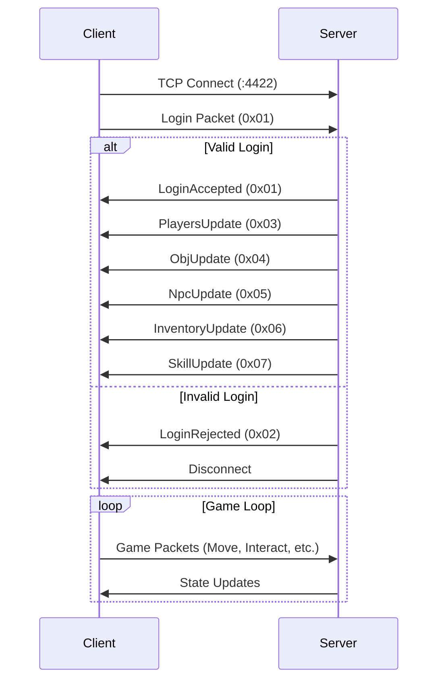

## Overview

GRPG uses a custom binary protocol over TCP for client-server communication. The protocol is built on the GBuf binary buffer system and uses opcode-based packet identification.

## Network Architecture

### Connection Flow



### Protocol Design

- **Transport**: TCP on port 4422
- **Encoding**: Binary with Big Endian byte order
- **Packet Structure**: `[Opcode:1] [Length:0-2] [Data:Variable]`
- **Concurrency**: Server handles multiple clients concurrently

<Note>
  TCP guarantees packet ordering and delivery, which is critical for maintaining consistent game state.
</Note>

## Packet Structure

### Fixed-Length Packets

Most packets have a known, fixed length:

```
[Byte]      Opcode (packet type)
[Bytes]     Packet data (fixed size)
```

### Variable-Length Packets

Some packets (like PlayersUpdate) have variable length:

```
[Byte]      Opcode (packet type)
[uint16]    Packet length in bytes
[Bytes]     Packet data (variable size)
```

<Info>
  Variable-length packets are identified by `Length = -1` in the packet definition.
</Info>

## Client-to-Server (C2S) Packets

Packets sent from the client to the server.

### Packet Registry

```go server/network/c2s/packet.go
type Packet interface {
    Handle(buf *gbuf.GBuf, game *shared.Game, player *shared.Player, scriptManager *scripts.ScriptManager)
}

type PacketData struct {
    Opcode  byte
    Length  int16  // -1 for variable length
    Handler Packet
}

var Packets = map[byte]PacketData{
    0x01: LoginData,      // Variable length
    0x02: MoveData,       // 9 bytes
    0x03: InteractData,   // 10 bytes
    0x04: TalkData,       // 10 bytes
    0x05: ContinueData,   // 0 bytes
}
```

### 0x01 - Login

Authenticates the player and loads their data.

**Structure:**
```
[uint32]    Name length
[bytes]     Player name (UTF-8)
```

**Handling:**
```go server/main.go
func handleLogin(reader *bufio.Reader, conn net.Conn, game *shared.Game) {
    nameLenBytes := make([]byte, 4)
    io.ReadFull(reader, nameLenBytes)
    nameLen := binary.BigEndian.Uint32(nameLenBytes)
    
    name := make([]byte, nameLen)
    io.ReadFull(reader, name)
    
    // Check for duplicate names
    for player, _ := range game.Players {
        if player.Name == string(name) {
            network.SendPacket(conn, &s2c.LoginRejected{}, game)
            return
        }
    }
    
    // Create and load player
    player := &shared.Player{Name: string(name), Conn: conn}
    player.LoadFromDB(game.Database)
    
    game.Players[player] = struct{}{}
    game.Connections[conn] = player
    
    // Send acceptance and initial state
    network.SendPacket(conn, &s2c.LoginAccepted{}, game)
    // ... send initial state packets
}
```

### 0x02 - Move

Requests player movement.

**Structure:**
```
[uint32]    New X position
[uint32]    New Y position
[byte]      Facing direction (0=UP, 1=RIGHT, 2=DOWN, 3=LEFT)
```

**Handling:**
```go server/network/c2s/move.go
func (m *Move) Handle(buf *gbuf.GBuf, game *shared.Game, player *shared.Player, scriptManager *scripts.ScriptManager) {
    newX, _ := buf.ReadUint32()
    newY, _ := buf.ReadUint32()
    facing, _ := buf.ReadByte()
    
    // Validate movement
    _, exists := game.CollisionMap[util.Vector2I{X: newX, Y: newY}]
    if newX > game.MaxX || newY > game.MaxY || exists || facing > 3 {
        return
    }
    
    prevChunkPos := player.ChunkPos
    chunkPos := util.Vector2I{X: newX / 16, Y: newY / 16}
    crossedZone := chunkPos != player.ChunkPos
    
    // Update player position
    player.Pos = util.Vector2I{X: newX, Y: newY}
    player.ChunkPos = chunkPos
    player.Facing = shared.Direction(facing)
    
    // Notify players in chunk
    network.UpdatePlayersByChunk(chunkPos, game, &s2c.PlayersUpdate{ChunkPos: chunkPos})
    
    // Handle zone crossing
    if crossedZone {
        network.UpdatePlayersByChunk(prevChunkPos, game, &s2c.PlayersUpdate{ChunkPos: prevChunkPos})
        network.SendPacket(player.Conn, &s2c.ObjUpdate{ChunkPos: chunkPos, Rebuild: true}, game)
        network.SendPacket(player.Conn, &s2c.NpcUpdate{ChunkPos: chunkPos}, game)
    }
}
```

<Tip>
  Movement packets are validated server-side to prevent cheating. The client's request can be rejected.
</Tip>

### 0x03 - Interact

Interacts with an object.

**Structure:**
```
[uint16]    Object ID
[uint32]    Object X position
[uint32]    Object Y position
```

**Handling:**
```go server/network/c2s/interact.go
func (i *Interact) Handle(buf *gbuf.GBuf, game *shared.Game, player *shared.Player, scriptManager *scripts.ScriptManager) {
    objId, _ := buf.ReadUint16()
    x, _ := buf.ReadUint32()
    y, _ := buf.ReadUint32()
    
    objPos := util.Vector2I{X: x, Y: y}
    
    // Validate player is facing object
    if player.GetFacingCoord() != objPos {
        return
    }
    
    // Execute interaction script
    script := scriptManager.InteractScripts[scripts.ObjConstant(objId)]
    script(scripts.NewObjInteractCtx(game, player, objPos))
}
```

### 0x04 - Talk

Initiates dialogue with an NPC.

**Structure:**
```
[uint16]    NPC ID
[uint32]    NPC X position
[uint32]    NPC Y position
```

### 0x05 - Continue

Continues through dialogue text.

**Structure:** (Empty - 0 bytes)

## Server-to-Client (S2C) Packets

Packets sent from the server to clients.

### Packet Interface

```go server/network/s2c/packet.go
type Packet interface {
    Opcode() byte
    Handle(buf *gbuf.GBuf, game *shared.Game)
}
```

### Sending Packets

```go server/network/network.go
func SendPacket(conn net.Conn, packet s2c.Packet, game *shared.Game) {
    buf := gbuf.NewEmptyGBuf()
    buf.WriteByte(packet.Opcode())
    packet.Handle(buf, game)
    conn.Write(buf.Bytes())
}

// Send to all players in a chunk
func UpdatePlayersByChunk(chunkPos util.Vector2I, game *shared.Game, packet s2c.Packet) {
    for player, _ := range game.Players {
        if player.ChunkPos == chunkPos {
            SendPacket(player.Conn, packet, game)
        }
    }
}
```

### 0x01 - LoginAccepted

Confirms successful login.

**Structure:** (Empty)

### 0x02 - LoginRejected

Rejects login attempt (duplicate name).

**Structure:** (Empty)

### 0x03 - PlayersUpdate

Sends information about all players in a chunk.

**Structure:**
```
[uint16]    Packet length
[uint16]    Number of players
For each player:
  [uint32]  Name length
  [bytes]   Player name
  [uint32]  X position
  [uint32]  Y position
  [byte]    Facing direction
```

**Implementation:**
```go server/network/s2c/players_update.go
type PlayersUpdate struct {
    ChunkPos util.Vector2I
}

func (p *PlayersUpdate) Opcode() byte {
    return 0x03
}

func (p *PlayersUpdate) Handle(buf *gbuf.GBuf, game *shared.Game) {
    packetLen := 2 // player count field
    playerLen := 0
    
    // Calculate packet size
    for player, _ := range game.Players {
        if player.ChunkPos == p.ChunkPos {
            packetLen += 4 + len(player.Name) + 4 + 4 + 1
            playerLen++
        }
    }
    
    buf.WriteUint16(uint16(packetLen))
    buf.WriteUint16(uint16(playerLen))
    
    // Write player data
    for player, _ := range game.Players {
        if player.ChunkPos == p.ChunkPos {
            buf.WriteString(player.Name)
            buf.WriteUint32(player.Pos.X)
            buf.WriteUint32(player.Pos.Y)
            buf.WriteByte(byte(player.Facing))
        }
    }
}
```

<Warning>
  Variable-length packets must write their length first, before any data.
</Warning>

### 0x04 - ObjUpdate

Updates object states in a chunk.

**Structure:**
```
[uint16]    Packet length
[bool]      Rebuild (true = full update)
[uint16]    Number of objects
For each object:
  [uint32]  X position
  [uint32]  Y position
  [byte]    State
```

### 0x05 - NpcUpdate

Updates NPC positions in a chunk.

**Structure:**
```
[uint16]    Packet length
[uint16]    Number of NPCs
For each NPC:
  [uint16]  NPC ID
  [uint32]  X position
  [uint32]  Y position
```

### 0x06 - InventoryUpdate

Sends player inventory state.

**Structure:**
```
[uint16]    Packet length
[24 items]
For each item:
  [uint16]  Item ID (0 = empty)
  [uint16]  Count
```

### 0x07 - SkillUpdate

Updates player skill levels and XP.

**Structure:**
```
[uint16]    Packet length
[byte]      Number of skills
For each skill:
  [byte]    Skill ID
  [byte]    Level
  [uint32]  XP
```

### 0x08 - Talkbox

Displays dialogue from NPCs.

**Structure:**
```
[uint16]    Packet length
[byte]      Type (0=CLEAR, 1=SET, 2=ADD)
[string]    Speaker name (if type != CLEAR)
[string]    Message (if type != CLEAR)
```

### 0x09 - NpcMoves

Animates NPC movement.

**Structure:**
```
[uint16]    Packet length
[uint16]    Number of moves
For each move:
  [uint32]  From X
  [uint32]  From Y
  [uint32]  To X
  [uint32]  To Y
```

## Client Implementation

### Receiving Packets

```go client/network/network_manager.go
func ReadServerPackets(conn net.Conn, packetChan chan<- ChanPacket) {
    defer conn.Close()
    reader := bufio.NewReader(conn)
    
    for {
        // Read opcode
        opcode, err := reader.ReadByte()
        if err != nil {
            log.Println("error reading packet opcode, conn lost")
            return
        }
        
        packetData := s2c.Packets[opcode]
        var bytes []byte
        
        // Handle variable-length packets
        if packetData.Length == -1 {
            lenBytes := make([]byte, 2)
            io.ReadFull(reader, lenBytes)
            packetLen := binary.BigEndian.Uint16(lenBytes)
            bytes = make([]byte, packetLen)
        } else {
            bytes = make([]byte, packetData.Length)
        }
        
        // Read packet data
        io.ReadFull(reader, bytes)
        buf := gbuf.NewGBuf(bytes)
        
        // Queue for processing
        packetChan <- ChanPacket{
            Buf:        buf,
            PacketData: packetData,
        }
    }
}
```

### Sending Packets

```go client/shared/game.go
func SendPacket(conn net.Conn, packet c2s.Packet) {
    buf := gbuf.NewEmptyGBuf()
    buf.WriteByte(packet.Opcode())
    packet.Handle(buf)
    conn.Write(buf.Bytes())
}
```

### Processing Packets

```go client/main.go
func processPackets(packetChan <-chan network.ChanPacket, g *shared.Game) {
    for {
        select {
        case packet := <-packetChan:
            packet.PacketData.Handler.Handle(packet.Buf, g)
        default:
            return
        }
    }
}
```

<Info>
  The client processes all pending packets each frame before updating game state.
</Info>

## Packet Flow Examples

### Player Movement

```
1. Client detects WASD input
2. Client sends Move packet (0x02) with new position
3. Server validates movement
4. Server updates player position in game state
5. Server sends PlayersUpdate (0x03) to all players in chunk
6. If chunk changed:
   - Server sends PlayersUpdate to old chunk
   - Server sends ObjUpdate (0x04) to player
   - Server sends NpcUpdate (0x05) to player
7. Client receives PlayersUpdate
8. Client updates remote player positions
9. Client animates local player movement
```

### Object Interaction

```
1. Client detects Q key
2. Client sends Interact packet (0x03) with object info
3. Server validates interaction
4. Server executes interaction script
5. Script may:
   - Modify object state → ObjUpdate packet
   - Give items → InventoryUpdate packet
   - Grant XP → SkillUpdate packet
   - Show dialogue → Talkbox packet
6. Client receives updates
7. Client renders changes
```

### Login Sequence

```
1. Client connects to server:4422
2. Client sends Login packet (0x01) with username
3. Server checks for duplicate names
4. If valid:
   - Server sends LoginAccepted (0x01)
   - Server sends PlayersUpdate (0x03) for spawn chunk
   - Server sends ObjUpdate (0x04) for spawn chunk
   - Server sends NpcUpdate (0x05) for spawn chunk
   - Server sends InventoryUpdate (0x06)
   - Server sends SkillUpdate (0x07)
5. If invalid:
   - Server sends LoginRejected (0x02)
   - Server closes connection
6. Client switches to Playground scene
```

## Network Optimization

### Chunk-Based Updates

Only players in the same chunk receive updates:

```go
func UpdatePlayersByChunk(chunkPos util.Vector2I, game *shared.Game, packet s2c.Packet) {
    for player, _ := range game.Players {
        if player.ChunkPos == chunkPos {
            SendPacket(player.Conn, packet, game)
        }
    }
}
```

Chunks are 16x16 tiles, reducing unnecessary network traffic.

### Packet Batching

The server processes packets in batches during each game tick:

```go
for {
    select {
    case packet := <-packets:
        buf := gbuf.NewGBuf(packet.Bytes)
        packet.PacketData.Handler.Handle(buf, g, packet.Player, scriptManager)
    default:
        break processPackets
    }
}
```

### Buffered Channels

- Server: 1000-packet buffer
- Client: 100-packet buffer

This handles burst traffic without blocking.

<Tip>
  Use variable-length packets only when necessary. Fixed-length packets are more efficient.
</Tip>

## Security Considerations

### Server-Side Validation

All client inputs are validated:

```go
// Validate position bounds
if newX > game.MaxX || newY > game.MaxY {
    return
}

// Validate collision
if _, exists := game.CollisionMap[newPos]; exists {
    return
}

// Validate facing direction
if facing > 3 {
    return
}

// Validate interaction range
if player.GetFacingCoord() != objPos {
    return
}
```

### Connection Handling

Each connection is isolated:

- Separate goroutine per connection
- Connection-to-player mapping
- Automatic cleanup on disconnect

```go
if err != nil {
    player, exists := game.Connections[conn]
    if exists {
        player.SaveToDB(game.Database)
        delete(game.Players, player)
        delete(game.Connections, conn)
    }
    return
}
```

## Related Documentation

<CardGroup cols={2}>
  <Card title="Server" icon="server" href="/components/server">
    Learn about server packet handling
  </Card>
  <Card title="Client" icon="desktop" href="/components/client">
    Understand client networking
  </Card>
  <Card title="Data Formats" icon="database" href="/components/data-formats">
    Learn about GBuf and binary encoding
  </Card>
</CardGroup>
