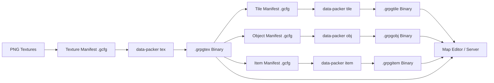

GRPG uses a custom asset pipeline that converts human-readable manifest files into optimized binary formats. This guide explains the complete workflow from asset creation to runtime usage.

## Pipeline Overview

The GRPG asset pipeline follows this flow:



<Steps>
  <Step title="Create Manifests">
    Write GCFG manifest files describing your game assets
  </Step>
  <Step title="Run data-packer">
    Convert manifests to optimized binary formats
  </Step>
  <Step title="Use in Game">
    Load binary files in the map editor and server
  </Step>
</Steps>

## Manifest Format (GCFG)

GRPG uses the [GCFG](https://github.com/grian32/gcfg) format for all manifests. It's a structured configuration format similar to INI but with better type support.

### Basic Syntax

```gcfg
# Comments start with #
[SectionName] {
    field1 = "string value"
    field2 = 42
    field3 = ["array", "of", "strings"]
}

# Multiple sections of the same type
[SectionName] {
    field1 = "another entry"
    field2 = 43
}
```

### Supported Types

- **String**: `name = "value"`
- **Integer**: `id = 42`
- **Array**: `items = ["one", "two", "three"]`
- **Boolean**: `enabled = true` (though not commonly used in GRPG manifests)

## Asset Types and Workflows

### 1. Textures (.grpgtex)

Textures are the foundation of the asset pipeline - all other assets reference textures.

<Steps>
  <Step title="Create Texture Manifest">
    ```gcfg textures.gcfg
    [Texture] {
        name = "grass_tex"
        id = 1
        path = "assets/grass.png"
    }

    [Texture] {
        name = "stone_tex"
        id = 2
        path = "assets/stone.png"
    }
    ```

    **Fields:**
    - `name` - String identifier used by other assets to reference this texture
    - `id` - Unique numeric ID (uint16, cannot be 0)
    - `path` - File path to PNG texture file
  </Step>

  <Step title="Pack Textures">
    ```bash
    ./grpgpack tex -m textures.gcfg -o textures.grpgtex
    ```

    **What happens:**
    1. Reads PNG files from paths
    2. Converts PNG to JPEG XL format (better compression)
    3. Writes binary file with magic header `GRPGTEX\x00`
    4. Stores internal name (string) and ID (uint16) for each texture

    From `data-packer/textures/manifest.go:25`:
    ```go
    jpegXlOptions := jpegxl.Options{
        Quality: 100,  // Lossless quality
        Effort:  10,   // Maximum compression effort
    }
    ```
  </Step>

  <Step title="Binary Format">
    The `.grpgtex` file structure from `data-go/grpgtex/grpgtex.go:31`:

    ```
    Header:   [8 bytes]  "GRPGTEX\x00"
    Count:    [4 bytes]  Number of textures (uint32)
    
    For each texture:
      NameLen:    [4 bytes]  Length of name string
      Name:       [N bytes]  Internal name as bytes
      ID:         [2 bytes]  Internal ID (uint16)
      ImageLen:   [4 bytes]  Length of image data
      ImageData:  [N bytes]  JPEG XL encoded image
    ```
  </Step>
</Steps>

### 2. Tiles (.grpgtile)

Tiles define ground types that fill the base layer of maps.

<Steps>
  <Step title="Create Tile Manifest">
    ```gcfg tiles.gcfg
    [Tile] {
        name = "grass"
        id = 1
        tex_name = "grass_tex"
    }

    [Tile] {
        name = "water"
        id = 2
        tex_name = "water_tex"
    }
    ```

    **Fields:**
    - `name` - Tile identifier
    - `id` - Unique tile ID (uint16)
    - `tex_name` - References a texture name from your `.grpgtex` file
  </Step>

  <Step title="Pack Tiles">
    ```bash
    ./grpgpack tile -m tiles.gcfg -t textures.grpgtex -o tiles.grpgtile
    ```

    The `-t` flag provides the texture file so the packer can:
    - Validate that referenced textures exist
    - Resolve texture names to numeric IDs
  </Step>
</Steps>

### 3. Objects (.grpgobj)

Objects are interactive entities placed on top of tiles.

<Steps>
  <Step title="Create Object Manifest">
    ```gcfg objects.gcfg
    [Obj] {
        name = "berry_bush"
        id = 1
        flags = ["STATE", "INTERACT"]
        textures = ["berry_bush_full", "berry_bush_empty"]
        interact_text = "Pick Berries"
    }

    [Obj] {
        name = "rock"
        id = 2
        flags = []
        textures = ["rock_tex"]
        interact_text = ""
    }
    ```

    **Fields:**
    - `name` - Object identifier
    - `id` - Unique object ID (uint16)
    - `flags` - Array of capability flags: `"STATE"`, `"INTERACT"`
    - `textures` - Array of texture names (index = state number)
    - `interact_text` - Text shown on interaction (required if `INTERACT` flag set)
  </Step>

  <Step title="Pack Objects">
    ```bash
    ./grpgpack obj -m objects.gcfg -t textures.grpgtex -o objects.grpgobj
    ```
  </Step>

  <Step title="Binary Format">
    From `data-go/grpgobj/grpgobj.go:51`:

    ```
    Header:   [8 bytes]  "GRPGOBJ\x00"
    Count:    [2 bytes]  Number of objects (uint16)
    
    For each object:
      Name:         [variable]  String (length-prefixed)
      ObjID:        [2 bytes]   Object ID (uint16)
      Flags:        [1 byte]    Capability flags bitmask
      
      If non-stateful:
        Texture:    [2 bytes]   Single texture ID
      If stateful:
        TexCount:   [2 bytes]   Number of textures
        Textures:   [N*2 bytes] Array of texture IDs
      
      If interactive:
        InteractTxt: [variable] String (length-prefixed)
    ```
  </Step>
</Steps>

### 4. Items (.grpgitem)

Items are objects that can be placed in player inventories.

<Steps>
  <Step title="Create Item Manifest">
    ```gcfg items.gcfg
    [Item] {
        name = "berries"
        id = 1
        texture = "berries_tex"
    }

    [Item] {
        name = "iron_ore"
        id = 2
        texture = "iron_ore_tex"
    }
    ```

    **Fields:**
    - `name` - Item identifier
    - `id` - Unique item ID (uint16)
    - `texture` - Single texture name for inventory icon
  </Step>

  <Step title="Pack Items">
    ```bash
    ./grpgpack item -m items.gcfg -t textures.grpgtex -o items.grpgitem
    ```
  </Step>
</Steps>

### 5. NPCs (.grpgnpc)

NPCs are non-player characters with dialogue and movement.

<Steps>
  <Step title="Create NPC Manifest">
    ```gcfg npcs.gcfg
    [Npc] {
        name = "merchant"
        id = 1
        texture = "merchant_tex"
    }
    ```
  </Step>

  <Step title="Pack NPCs">
    ```bash
    ./grpgpack npc -m npcs.gcfg -t textures.grpgtex -o npcs.grpgnpc
    ```
  </Step>
</Steps>

## The data-packer CLI

### Installation

```bash
cd data-packer
go build -o grpgpack
```

This creates the `grpgpack` executable.

### Command Structure

From `data-packer/main.go:18`:

```bash
grpgpack <subcommand> [flags]
```

**Subcommands:**
- `tex` - Pack textures
- `tile` - Pack tiles
- `obj` - Pack objects
- `item` - Pack items
- `npc` - Pack NPCs

### Common Flags

| Flag | Short | Description | Default |
|------|-------|-------------|----------|
| `--manifest` | `-m` | Path to manifest file | (required) |
| `--output` | `-o` | Output file path | Type-specific |
| `--textures` | `-t` | Path to `.grpgtex` file | (required for non-tex types) |

### Example Workflow

```bash
# 1. Pack textures first (no dependencies)
./grpgpack tex -m textures.gcfg -o textures.grpgtex

# 2. Pack tiles (references textures)
./grpgpack tile -m tiles.gcfg -t textures.grpgtex -o tiles.grpgtile

# 3. Pack objects (references textures)
./grpgpack obj -m objects.gcfg -t textures.grpgtex -o objects.grpgobj

# 4. Pack items (references textures)
./grpgpack item -m items.gcfg -t textures.grpgtex -o items.grpgitem

# 5. Pack NPCs (references textures)
./grpgpack npc -m npcs.gcfg -t textures.grpgtex -o npcs.grpgnpc
```

<Note>
  Always pack textures first! Other asset types reference textures and will fail validation if the texture file doesn't exist or is missing referenced textures.
</Note>

## Binary Format Details

### Why Binary Formats?

GRPG uses custom binary formats instead of JSON/YAML for several reasons:

1. **Size** - Binary data is more compact than text
2. **Speed** - Faster to parse (no text-to-number conversion)
3. **Type Safety** - Fixed-size types prevent runtime errors
4. **Compression** - JPEG XL textures are much smaller than PNG

### The GBuf Abstraction

All binary reading/writing uses `data-go/gbuf`, a buffer wrapper that simplifies binary I/O:

```go data-go/gbuf/gbuf.go
type GBuf struct {
    buf    []byte
    offset int
}

// Writing
func (g *GBuf) WriteUint16(val uint16)
func (g *GBuf) WriteString(val string)
func (g *GBuf) WriteBytes(val []byte)

// Reading
func (g *GBuf) ReadUint16() (uint16, error)
func (g *GBuf) ReadString() (string, error)
func (g *GBuf) ReadBytes(length int) ([]byte, error)
```

This abstraction:
- Handles endianness automatically (uses big-endian)
- Tracks read/write offset
- Provides clean error handling
- Prevents buffer overflow vulnerabilities

### Magic Headers

All GRPG binary formats start with an 8-byte magic header for validation:

| Format | Magic Header |
|--------|-------------|
| Textures | `GRPGTEX\x00` |
| Tiles | `GRPGTILE\x00` |
| Objects | `GRPGOBJ\x00` |
| Items | `GRPGITEM\x00` |
| NPCs | `GRPGNPC\x00` |
| Maps | `GRPGMAP\x00` |

Readers verify the magic header before parsing to detect corrupted or wrong file types.

## Advanced Topics

### Texture Compression

From `data-packer/textures/manifest.go:47`:

```go
jpegXlOptions := jpegxl.Options{
    Quality: 100,  // Lossless compression
    Effort:  10,   // Maximum effort (slower but smaller)
}
```

JPEG XL provides:
- **Better compression** than PNG (typically 30-50% smaller)
- **Lossless quality** at Quality: 100
- **Fast decoding** on modern hardware
- **Wide format support** (8-bit, 16-bit, HDR)

### Manifest Validation

The data-packer validates manifests during packing:

```go data-packer/objs/manifest.go:36
if !grpgobj.IsFlagSet(flags, grpgobj.INTERACT) && entry.InteractText != "" {
    return nil, errors.New("interact_text without interact flag not allowed")
}
```

Common validation rules:
- Texture ID cannot be 0 (reserved)
- `interact_text` requires `INTERACT` flag
- Texture references must exist in provided `.grpgtex` file
- IDs must be unique within each asset type

### Automated Build Scripts

The `data-packer/buildtobin.sh` script automates the entire pipeline:

```bash data-packer/buildtobin.sh
#!/bin/bash
go build -o grpgpack

./grpgpack tex -m testdata/test_tex_manifest.gcfg -o textures.grpgtex
./grpgpack tile -m testdata/test_tile_manifest.gcfg -t textures.grpgtex -o tiles.grpgtile
./grpgpack obj -m testdata/test_obj_manifest.gcfg -t textures.grpgtex -o objects.grpgobj
# ...
```

Create similar scripts for your game to streamline asset updates.

## Performance Considerations

### File Sizes

Typical file sizes for a small game:

- **Textures**: 500KB - 5MB (depends on JPEG XL compression)
- **Tiles**: 1-10KB (just references + metadata)
- **Objects**: 2-20KB (includes state/interaction data)
- **Items**: 1-5KB (minimal data)
- **Maps**: ~1KB per chunk (fixed size)

### Loading Strategy

The server loads assets at startup:

1. Load texture file once (shared by all systems)
2. Load tile/object/item/NPC files
3. Map chunks loaded dynamically as players move

<Info>
  Because binary formats are compact and fast to parse, loading even thousands of assets takes milliseconds.
</Info>

## Troubleshooting

<AccordionGroup>
  <Accordion title="Error: Integer ID 0 is reserved">
    From `data-packer/textures/manifest.go:57`, ID 0 is reserved for "empty" or "null" values.
    
    **Solution:** Start your IDs from 1:
    ```gcfg
    [Texture] {
        id = 1  # Not 0
    }
    ```
  </Accordion>

  <Accordion title="Error: interact_text without interact flag not allowed">
    You set `interact_text` but didn't include the `INTERACT` flag.
    
    **Solution:**
    ```gcfg
    flags = ["INTERACT"]  # Add this
    interact_text = "Use Item"
    ```
  </Accordion>

  <Accordion title="Error: failed to decode png image">
    The texture path points to a non-PNG file or corrupted file.
    
    **Solution:**
    - Verify the path is correct
    - Ensure the file is a valid PNG
    - Check file permissions
  </Accordion>

  <Accordion title="Texture references not resolving">
    Other asset types can't find textures by name.
    
    **Solution:**
    - Ensure you packed textures first
    - Verify texture names match exactly (case-sensitive)
    - Pass correct texture file with `-t` flag
  </Accordion>
</AccordionGroup>

## Build Automation Example

Create a `Makefile` for your game assets:

```makefile Makefile
GRPGPACK := ./grpgpack
TEX_FILE := textures.grpgtex

.PHONY: all clean

all: textures tiles objects items npcs

textures:
	$(GRPGPACK) tex -m manifests/textures.gcfg -o $(TEX_FILE)

tiles: textures
	$(GRPGPACK) tile -m manifests/tiles.gcfg -t $(TEX_FILE) -o tiles.grpgtile

objects: textures
	$(GRPGPACK) obj -m manifests/objects.gcfg -t $(TEX_FILE) -o objects.grpgobj

items: textures
	$(GRPGPACK) item -m manifests/items.gcfg -t $(TEX_FILE) -o items.grpgitem

npcs: textures
	$(GRPGPACK) npc -m manifests/npcs.gcfg -t $(TEX_FILE) -o npcs.grpgnpc

clean:
	rm -f *.grpg*
```

Usage:
```bash
make all      # Build everything
make textures # Build only textures
make clean    # Remove all binary files
```

## Next Steps

<CardGroup cols={2}>
  <Card title="Custom Objects" icon="cube" href="/guides/custom-objects">
    Create your first custom object with the asset pipeline
  </Card>
  <Card title="Map Creation" icon="map" href="/guides/map-creation">
    Use your packed assets in the map editor
  </Card>
</CardGroup>
